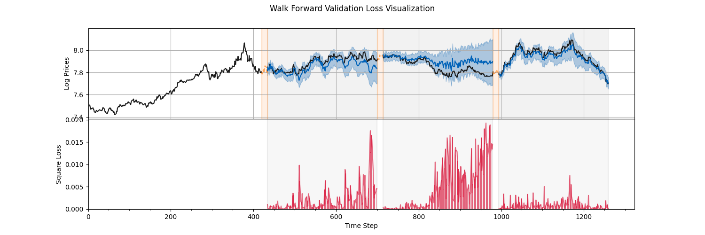

# Commodity Prices Prediction
Part of my master project, which includes the following algorithms 

- [x] ARIMA
- [x] Gaussian Process
- [x] Multi-Task Gaussian Process
- [x] Multi-Task Index Gaussian Process (Use index of each task)
- [x] Deep Gaussian Process with Multi-Task Output
- [x] Deep Sigma Point Process with Multi-Task Output
- [x] Sparse Multi-Task Index Gaussian Process
- [x] Sparse Matern Graph Gaussian Process
- [x] Deep Graph Kernel 
- [x] Deep Graph Kernel + Deep Graph Infomax Pretraining
- [ ] Cluster Multi-Task GP (Pyro + Gpytorch)
- [ ] Non-Linear Deep Multi-Task GP
- [ ] Non-Linear Deep Sigma Point Process
- [ ] Cluster Non-Linear Deep Multi-Task GP
- [ ] Cluster Non-Linear Deep Sigma Point Process
- [ ] Learning Graph GP


See `main.py` for examples. Running a Test for Data-Splitting Algorithm. The data should be stored in `data/{metal_name}`.

```sh
python -m pytest
```

For example, we have:


One may be interested in training the GP within google colabs, we have provided a simple way to zip the necessary files/folder

```sh
sh upload/zip_folders.sh
```
where we can upload to the colabs, extract the file and then perform the training.