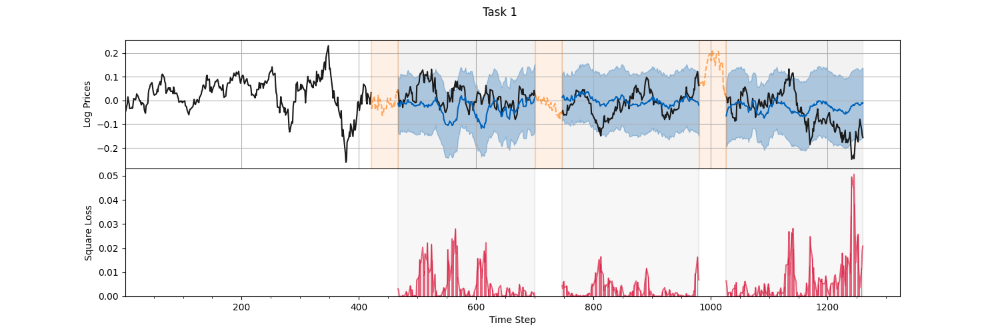

# Commodity Prices Prediction
Part of my master project, which includes the following algorithms 

- [x] ARIMA
- [x] Gaussian Process

See `main.py` for examples. Running a Test for Data-Splitting Algorithm. The data should be stored in `data/{metal_name}`.

```sh
python -m pytest
```

For example, we have:


One may be interested in training the GP within google colabs, we have provided a simple way to zip the necessary files/folder

```sh
sh upload/zip_folders.sh
```
where we can upload to the colabs, extract the file and then perform the training.